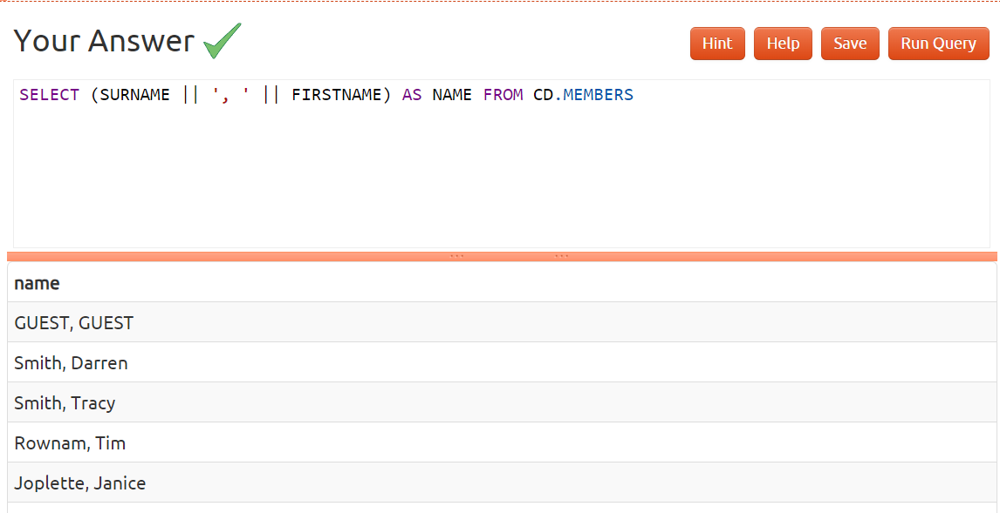
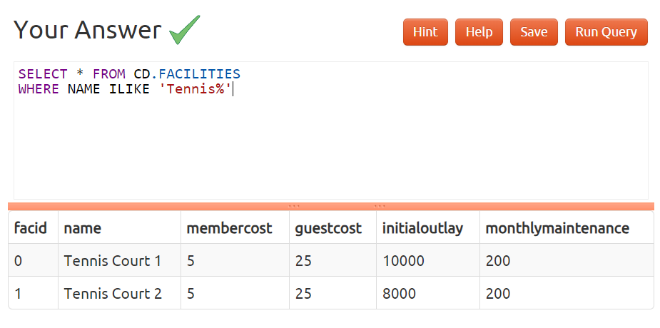
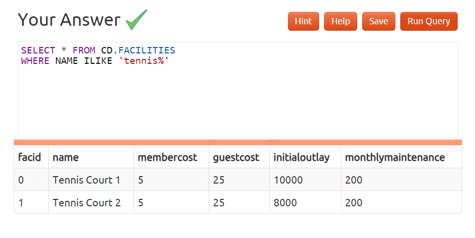
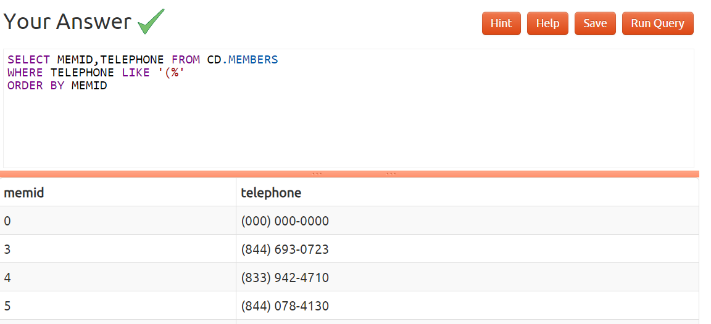
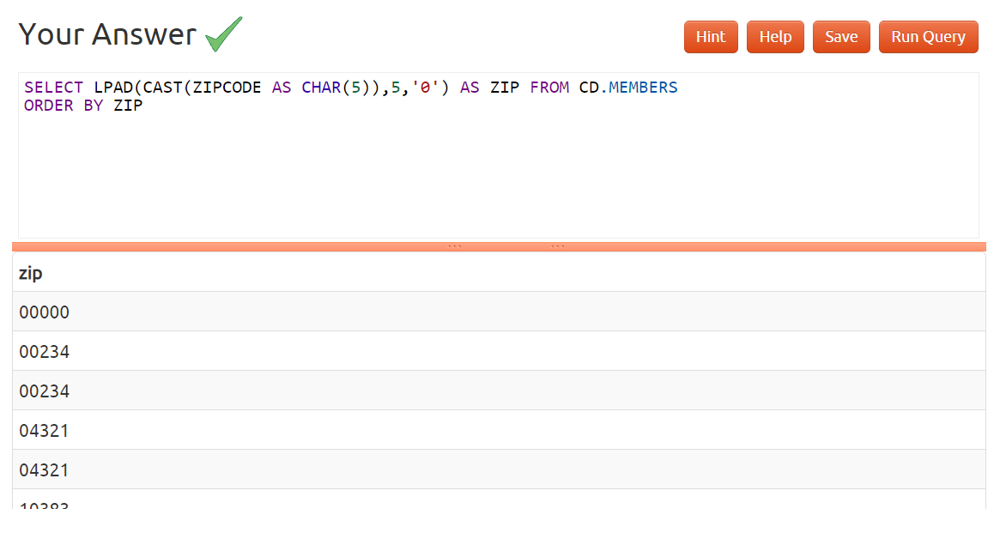
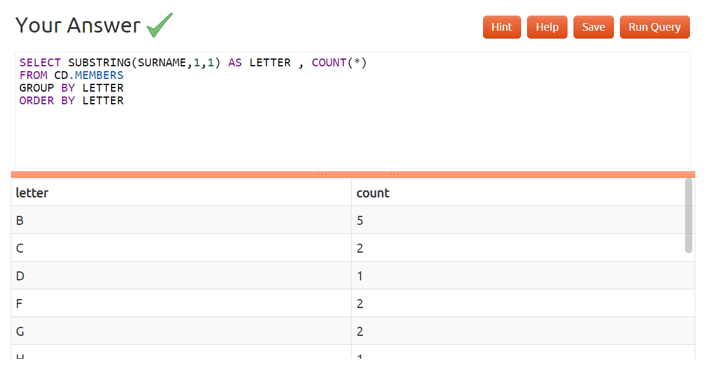
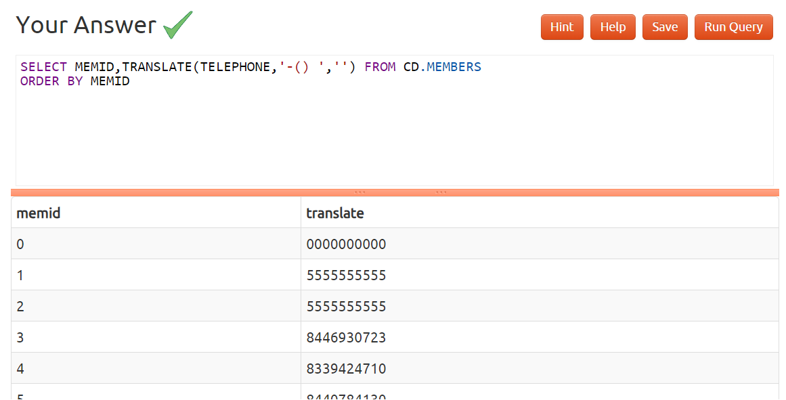

### Q1 : Output the names of all members, formatted as 'Surname, Firstname'

### Q2 : Find all facilities whose name begins with 'Tennis'. Retrieve all columns.

### Q3 : Perform a case-insensitive search to find all facilities whose name begins with 'tennis'. Retrieve all columns.

### Q4 : You've noticed that the club's member table has telephone numbers with very inconsistent formatting. You'd like to find all the telephone numbers that contain parentheses, returning the member ID and telephone number sorted by member ID.

### Q5 : The zip codes in our example dataset have had leading zeroes removed from them by virtue of being stored as a numeric type. Retrieve all zip codes from the members table, padding any zip codes less than 5 characters long with leading zeroes. Order by the new zip code.

### Q6 : You'd like to produce a count of how many members you have whose surname starts with each letter of the alphabet. Sort by the letter, and don't worry about printing out a letter if the count is 0.

### Q7 : The telephone numbers in the database are very inconsistently formatted. You'd like to print a list of member ids and numbers that have had '-','(',')', and ' ' characters removed. Order by member id.
